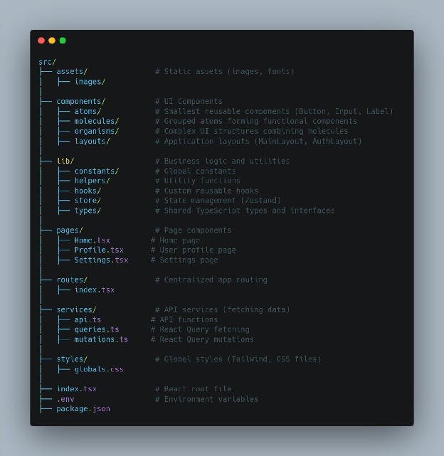

# Folder Structure

Related page: [React Architecture](../react-js/react-architecture.md).

This page is a quick visual/reference note. For complete scalable architecture guidance, study [React Architecture](../react-js/react-architecture.md).

🚀 Structuring Your React Project for Scalability & Maintainability 🏗️

A well-structured project can save you hours of debugging and make collaboration seamless. Here’s a battle-tested approach to structuring your React project\!

🔥 Why This Structure?  
✅ Scalable \- Works for small to large apps  
✅ Reusable \- Keeps UI elements modular  
✅ Maintainable \- Separates concerns for easy debugging  
✅ Optimized for Tailwind \- No unnecessary stylesheets
